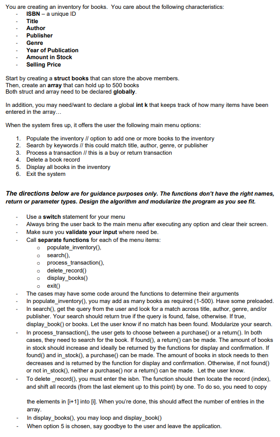

# Books Inventory

This is final exam submitted for the 'Algorithm & Programming' course at LaSalle College

## Table of contents

- [Overview](#overview)
  - [Question](#question)
  - [For demo](#for-demo)
  - [Useful resources](#useful-resources)
- [Author](#author)

## Overview

### Question

### For demo
- [https://vimeo.com/705001892](https://vimeo.com/705001892)

### Useful resources

- [Dummy data for books](https://gist.github.com/nanotaboada/6396437) - I get dummy data for books from here.

## Author

- Varun Grover - [@thevarungrovers](https://www.github.com/thevarungrovers)

